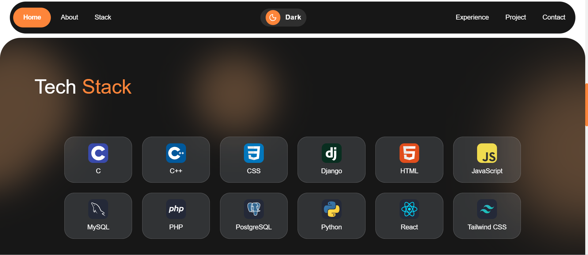

# Frontend (React + Vite + Express)

Application front de portfolio prête pour la prod, construite avec React 18, TypeScript, Vite, TailwindCSS, Radix UI et un serveur Express intégré pour le dev et les fonctions serverless.


## Aperçu
- SPA (React Router) avec pages publiques: Accueil, Projets, Blog, Détails.
- Espace Admin protégé (guard + layout persistant).
- Thème clair/sombre, animations (Framer Motion).
- API locale intégrée et proxy vers un backend externe si configuré.

## Prérequis
- Node.js ≥ 18
- pnpm (recommandé) ou npm

## Installation
```bash
pnpm install
```

## Démarrer en local
```bash
pnpm dev
```
- Front + API de dev sur le même port (Vite + Express intégrés).
- Données mockées si aucun backend n’est configuré (voir VITE_API_BASE_URL ci‑dessous).

## Build & exécution
```bash
# Build SPA + server
pnpm build

# Lancer le build de prod
pnpm start
```

## Tests & qualité
```bash
pnpm test        # Vitest (mode run)
pnpm typecheck   # Vérification TypeScript
pnpm format.fix  # Formatage Prettier
```

## Variables d’environnement
Cr��er un fichier .env à la racine du dossier `frontend/` si nécessaire.

Exemples utiles:
```
# URL de votre backend (Django, etc.). Si vide, l’UI utilise des mocks.
VITE_API_BASE_URL=https://votre-backend.example.com

# Optionnel: personnalise /api/ping côté dev
PING_MESSAGE=ping

# Optionnel: identifiant de build pour le cache-busting des images
VITE_BUILD_ID=1
```
Notes:
- Les variables `VITE_*` sont visibles côté client (ne mettez jamais de secrets).
- Ne commitez pas de secrets. Utilisez les variables d’environnement de votre plateforme d’hébergement.

## Structure du projet
```
frontend/
  client/                 # Code React (SPA)
    pages/               # Routes (Index, Blog, Projects, Admin...)
    components/          # UI & composants métiers (Radix, shadcn-style)
    hooks/               # Hooks (API, debounce, etc.)
    lib/                 # Utils (config, helpers)
    global.css           # Thème Tailwind
    App.tsx              # Entrée SPA + routing
  server/                # Express intégré (dev/proxy)
    routes/              # Handlers d’API (ex: demo)
    index.ts             # createServer()
    node-build.ts        # Entrée prod
  shared/                # Types partagés (ex: DemoResponse)
  public/                # Static assets (icônes, images)
  netlify/               # Fonctions serverless (Netlify)
    functions/api.ts
  tailwind.config.ts     # Config Tailwind
  vite.config.*          # Config Vite (client et server)
  package.json
```

## Routage (extraits)
Déclaré dans `client/App.tsx`:
- `/` Accueil
- `/projects/:id` Détail projet
- `/blog` Liste des articles
- `/blog/:slug` Détail article
- `/reset-password/:uid/:token`
- `/admin` (login)
- `/admin/*` (dashboard, projets, expériences, blog, skills, contenu, profil)

## API intégrée et proxy
Le serveur Express (`server/index.ts`) expose:
- `GET /api/ping` → `{ message: string }` (utilise `PING_MESSAGE` si défini)
- `GET /api/demo` → exemple de réponse typée (`shared/api.ts`)
- Proxys vers un backend si `VITE_API_BASE_URL` est défini:
  - `GET /api/core/hero/`
  - `GET /api/core/about/`
  - `GET /api/skills/`
  - `GET /api/blog/posts/`
  - `GET /api/experiences/` (pagination supportée)
  - `GET /api/projects/` et `GET /api/projects/:id/`
  - `POST /api/core/contact/`
Sinon, des données mockées sont renvoyées pour permettre l’aperçu en local.

## UI & Styles
- TailwindCSS 3 (design tokens via `client/global.css`).
- Composants Radix UI, icônes Lucide, animations Framer Motion.
- Utilitaire `cn()` pour composer les classes.

## Déploiement (Netlify recommandé)
Ce dépôt inclut `frontend/netlify.toml`:
- Build command: `npm run build:client`
- Publish directory: `dist/spa`
- Functions: `netlify/functions`
- Redirect API: `[[redirects]] from "/api/*" → `/.netlify/functions/api/:splat`

Étapes:
1) Connectez le repo à Netlify.
2) Définissez vos variables d’env. (ex: `VITE_API_BASE_URL`).
3) Déployez. Les fonctions serviront les routes `/api/*`.

Alternative: autres hébergeurs compatibles Vite/Node (adaptez la commande de build et le dossier `dist/`).

## Sécurité
- Ne mettez jamais de secrets dans des variables `VITE_*` (côté client).
- Utilisez les variables d’environnement de l’hébergeur pour les clés sensibles.

## Captures d’écran (aperçu rapide)
Vous pouvez prévisualiser l’interface avec les assets existants:





## Licence
Ce projet est fourni tel quel; adaptez la licence selon vos besoins.
